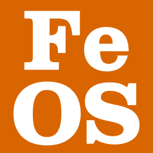

<p align="center">
  <a href="https://github.com/atitoff-dotcom/FerrumOS">
    
  </a>
</p>

<h1 align="center">FerrumOS</h1>

<p align="center">
  <strong>Reactive Micro-OS & Live Hot-Swap Studio for RISC-V & ESP32 Microcontrollers.</strong>
</p>

<p align="center">
  <a href="releases/v0.6.0/"></a>
  <a href="LICENSE"></a>
  <a href="#quick-install"></a>
  <a href="#supported-hardware"></a>
  <a href="rfcs/"></a>
</p>

<p align="center">
  <a href="#quick-install">🚀 <b>Quick Install</b></a> |
  <a href="#fluent-chaining-api">📐 <b>Fluent JS API</b></a> |
  <a href="rfcs/">📋 <b>RFC Specifications</b></a> |
  <a href="#supported-hardware">🔌 <b>Hardware</b></a>
</p>

---

FerrumOS is an ultra-fast, bare-metal reactive micro-operating system and live development environment for IoT edge devices, sensors, and smart home automation.

Write clean **Modern JavaScript**, deploy tasks to running hardware in **15 milliseconds over USB / Wi-Fi without restarting the chip**, and monitor live digital twins and pinout telemetry in real time.

All user documentation, code snippets, and interactive guides are built directly into **FerrumOS Studio**. Architectural blueprints and wire protocol standards are maintained in the [RFC Registry](rfcs/).

---

## 🚀 Quick Install (Zero Dependencies)

### Windows (PowerShell):
```powershell
irm https://raw.githubusercontent.com/atitoff-dotcom/FerrumOS/main/tools/install.ps1 | iex
```

### Linux / macOS (Bash):
```bash
curl -fsSL https://raw.githubusercontent.com/atitoff-dotcom/FerrumOS/main/tools/install.sh | bash
```

Once installed, launch the web studio with a single command:
```bash
ferrum studio
```
FerrumOS Studio will open in your default browser.

---

## 📐 Fluent Chaining API

FerrumOS uses strictly atomic fluent chaining for all hardware configuration:

```javascript
// Relay / Digital Output (Atomic Push-Pull initialization)
const relay = GPIO.output(15)
    .openDrain(false)
    .invert(false)
    .initial(false);

relay.high();
delay(100);
relay.low();

// Smart Button with hardware debounce and gesture detection
const btn = GPIO.button(9)
    .pullUp()
    .debounce(30);

btn.onClick(() => relay.toggle());
btn.onHold(() => relay.low());
```

---

## 🔌 Supported Hardware

* **ESP32-C6**: Primary target (RISC-V 160MHz, Wi-Fi 6, BLE 5.3, Thread/Zigbee 802.15.4, CAN/TWAI).
* **ESP32-C3**: Compact edge nodes (RISC-V 160MHz, Wi-Fi 4, BLE 5.0).
* **ESP32-S3**: Dual-core compute & camera nodes (Xtensa LX7).

---

## 📚 RFC Specifications (Single Source of Truth)

All architectural proposals, bytecode opcodes, protocols, and hardware specifications live in the [rfcs/](rfcs/) directory. Each RFC features two living sections:
* `## Реализовано` — exact wire protocols, opcodes, and verified snippets for Studio.
* `## Планируется` — future roadmap and planned features.

Check the [RFC Index](rfcs/README.md) for complete details.

---

## 📄 License

FerrumOS is open-source software licensed under the [Apache License 2.0](LICENSE).
